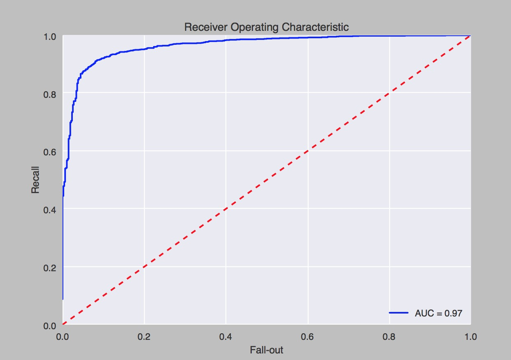

# fletcher
The point of this project is to train a classifier to distinguish real from fake reviews on trip advisor

##Data
####All data is reviews about a subset of Chicago hotels from various sources
- 4153 real reviews
  - scraped from Expedia where reviews are inherently real
    - where in order to post a review you must have booked the hotel through Expedia
- 800 fake reviews
  - made by paid workers on Amazon MechanicalTurk on the subset of Chicago hotel analyzed
    - thank you to M. Ott, Y. Choi, C. Cardie, and J.T. Hancock. 2011. [Finding Deceptive
      Opinion Spam by Any Stretch of the Imagination. In Proceedings of the 49th
      Annual Meeting of the Association for Computational Linguistics: Human Language
      Technologies] for providing me with this data! You guys saved me a ton of money and time!
- 2614 'unlabeled' reviews
  - scraped from TripAdvisor where a review can be real or fake
    - anyone with an account can review a hotel, so all inherently unsure of the review's veracity

##Methodoloy
- Problem:
  - It is very hard to train a classifier to perform this task because getting reviews which you know are fake is very hard
    - First step to solution was acquiring fake reviews that people were payed to write from mturk
      - But I didn't think 800 reviews would be enough to train a classifier well
    - Second step was designing a Positive-Unlabeled (PU) learning algorithm
      - which uses SPY method to infer which reviews from the unlabeled set are fake
    - Third and final step is to train a Support Vector Machine classifier on the newly partioned
      - Aggreagated the real negative data from SPY method with the 800 fake reviews from mturk [prediction = 0]
                                                                    2614 real reviews from Expeida [prediction = 1]
      - Trained and tested classifier with this data

##Positive-Unlabeled (PU) learning algorithm
- Step 1:
  - Infer a set of fake reviews from the unlabeled set using the spy method
  - SPY method:
    - determines a set of 'real negative data' (RN) (meaning fake reviews in this case)
        - from only unlabelled(U) and positive(P) data
    - pseudo-code:
      1. RN = null
      2. S = 15% of P , randomly selected
      3. U' = U u S  -> label: 0
      4. P' = P - S  -> label: 1
      5. Run I-EM on (U', P') -> produces NB classifier
      6. classify each document in U' using the NB classifier created
      7. determine probability threshold (th) using S
          - this part is arbitrary
          - need to look at what values of S are classified as
              - determine from there
      8. loop and update:
           - for each document d-e-U'
              - if Pr(1|d) < th then:
                  - RN = RN u {d}

##Results
- Spy method:
  - ran it over 10 times (with 20% spies) and on avg misclassified only 2.5% of the real as fake
    - already much better results than I was expecting
- Final classification
  - Ran sklearn's gridsearch to tune SVC algorithm parameters
    - Best performing: SVC(kernel='rbf', C=1, gamma=1, probability=True)
      - cross-validated 10 times with 88.2% mean accuracy
      - example iteration:
        - accuracy: 0.908984145625
        - precision: 0.906994047619
        - recall: 0.975980784628

ROC curve for this example
